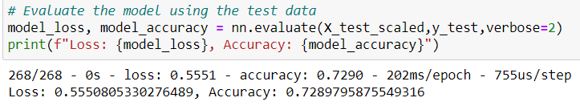
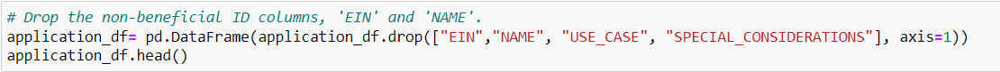
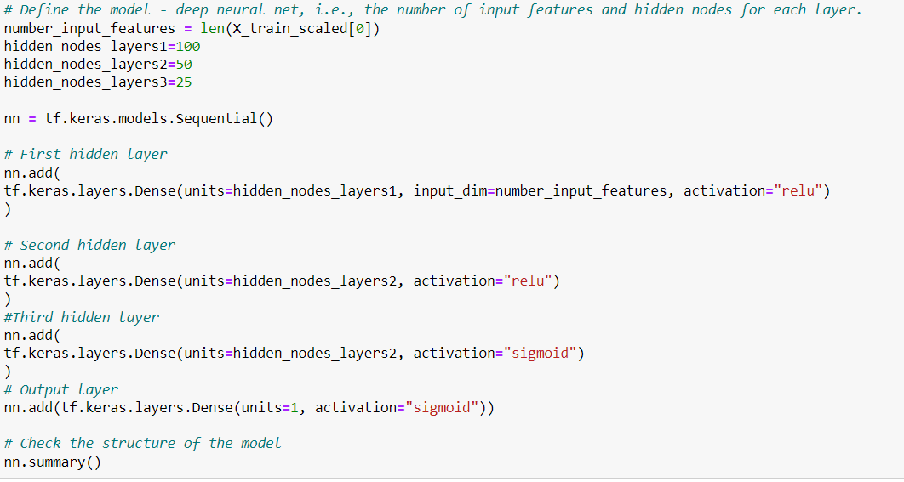
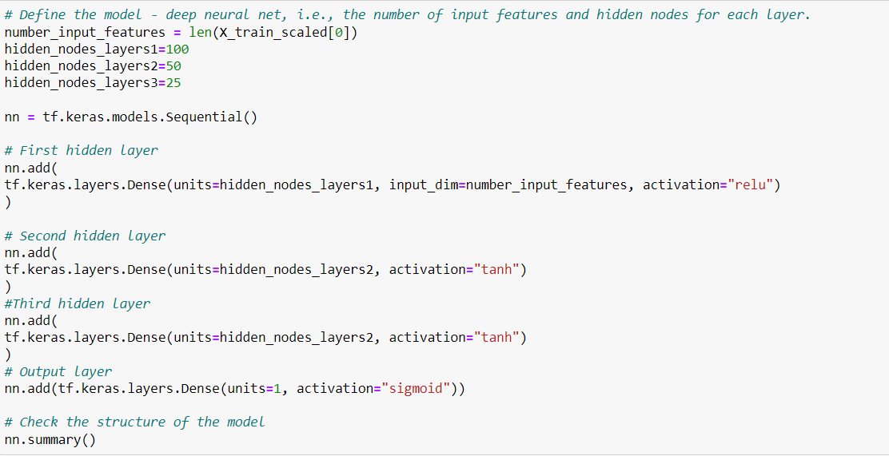

# Neural_Network_Charity_Analysis
## Overview
In our analysis, we preprocess our data and use neural networks to build a model to help our client create a system to easily determine which orginizations used the money effectively.
## Results
**What variable(s) are considered the target(s) for your model?**  
In our model, we have our target as was the money used effectively in our column IS_SUCCESSFUL.  
 
**What variable(s) are considered to be the features for your model?**  
The rest of our dataset we used in our analysis as the features. This includes, Application_type, Affiliation, Classification, Use Case, Organization, Status, Income Amount, Special Considerations, and Ask Amount.  
 
**What variable(s) are neither targets nor features, and should be removed from the input data?**  
We removed the variables EIN and Name as they were neither usefule targets or features.  
**Compiling, Training, and Evaluating the Model**  
**How many neurons, layers, and activation functions did you select for your neural network model, and why?**  
In our neural network model we used 2 hidden layers. The first with 80 neurons and the second with 30. We used ReLu activation for our hidden layers. For our output we use the sigmoid activation.  
 
**Were you able to achieve the target model performance?**
With our original model we reached an accuracy level of .72. We used tensorflow to  attempt to optimize our model performance. The following image shows our original model performance:  

 
What steps did you take to try and increase model performance?  
We first attempted to get rid of extraneous figures that did not add to the optimization of the model:  

After our optimization attempts we were able to increase our accuracy to .73.

## Summary
Overall in our attempts we were unable to reach a .75 accuracy level but we were able to make small improvements. By removing extraneous features from considered in the model and by addin hidden layers this help us reach better accuracy. Also by changing the acitivation of two of our hidden layers to tahn we are about to teest the model in other layers that we may not have seen in the previous model. 
